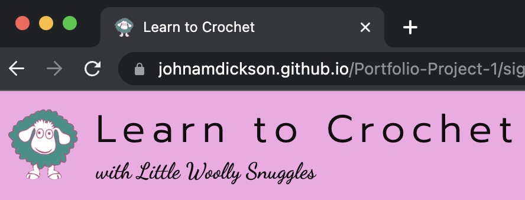
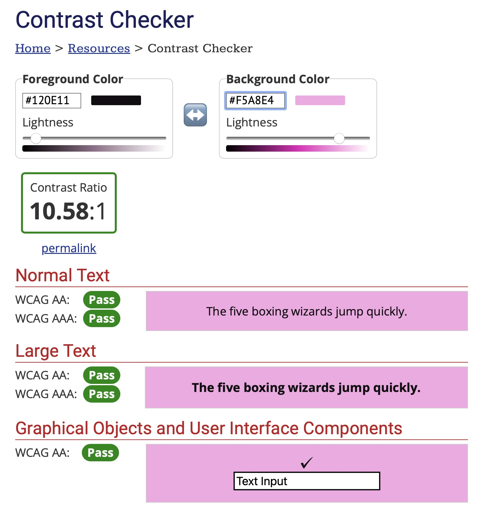
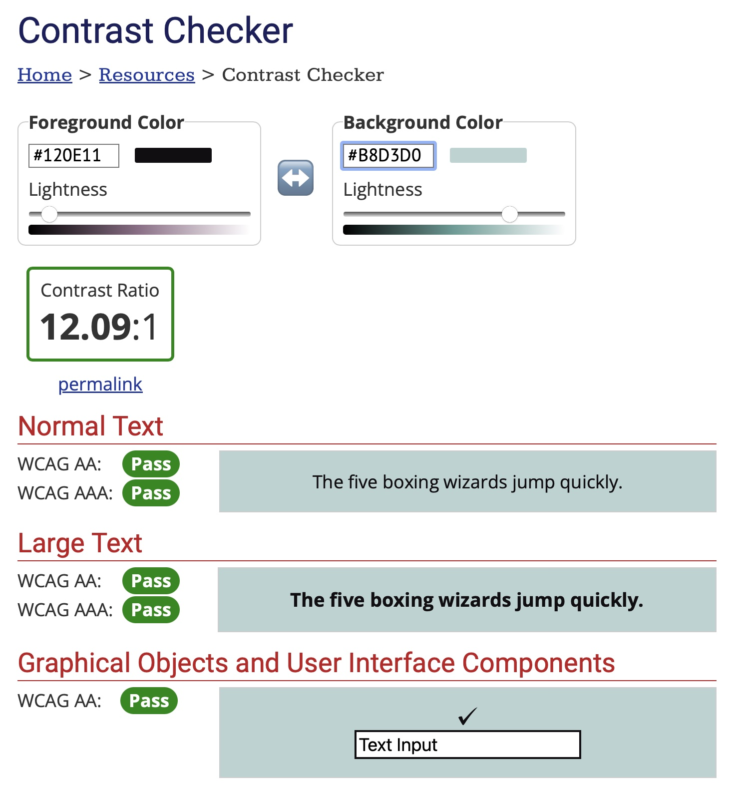
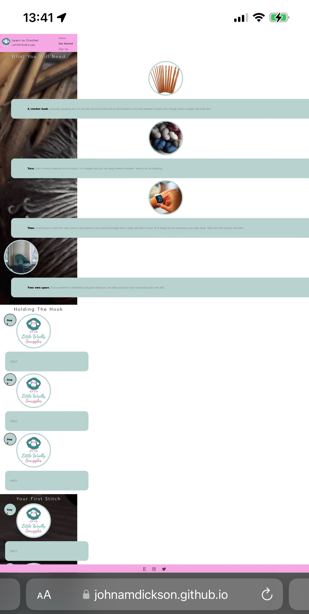

#  Learn to Crochet by Little Woolly Snuggles

Learn to Crochet is a website created for Little Woolly Snuggles, a handmade craft business that specialises in crochet and knit products. The site is targeted towards people that are interested in learning crochet by introducting them to the craft and showing them the basics. 

This website is showcasing HTML and CSS design for Project Portfolio 1 and can be accessed by following this [link.](https://johnamdickson.github.io/Portfolio-Project-1/index.html)

## Contents
- [UX](#ux)
  - [Site Goals](#site-goals)
  - [User Stories](#user-stories)
  - [Wireframes](#wireframes)
  - [Further Reading](#further-reading)
- [Design](#design)
  - [Colour Scheme](#colour-scheme)
    -  [Jet Stream](#jet-stream)
    - [Illusion](#illusion)
  - [Typography](#typography)
- [Features](#features)
  - [Existing Features](#existing-features)
  - [Features Left to Implement](#features-left-to-implement)
- [Testing](#testing)
  - [Development Testing](#development-testing)
  - [Validator Testing](#validator-testing)
  - [Bugs / Issues](#bugs--issues)
  - [Unresolved Bugs / Issues](#unresolved-bugs-or-issues)
- [Deployment](#deployment)
- [Credits](#credits)
  - [Content](#content)
  - [Media](#media)

## UX
### Site Goals
The goal of Learn to Crochet is to a resource which educates users about crochet and offers tips on how to get started along with an optional sign up page.
### User Stories
- As a user:
  - I want to learn how to crochet.
  - I want to understand what the site is about.
  - I want to received free crochet patterns by signing up to the newsletter.
  - I want to engage with Little Woolly Snuggles on social media.
  

- As the site administrator:
  - I want users to identify the website as a crafting resource using softer colours and relevant images.
  - I want to incentivise user sign up to the newsletter by offering free crochet patterns.
  - I want users to become familiar with the Little Woolly Snuggles brand.
  - I want users to follow social media links to further increase brand engagement.
  - I want users to access the linked Etsy shop.
### Wireframes
The wirframes for the project can be found [here.](/assets/README-files/Project%20Portfolio%201%20Wireframe.pdf)
### Further Reading
- The various UX design phases are descirbed in more detail here [pdf.](/assets/README-files/5%20Steps%20of%20UX%20Design%20Project%201.pdf)

## Design
### Colour Scheme
- The colour scheme was selected  to provide a match with the dominant two colours in the logo. At first the colours were sampled using a dropper, with a more purple colour for the header and footer and a darker green for the applicable body elements backgrounds. 
- Feedback from the client led to a revision of the colours towards pink for the header and footer and a pastel green for the main element backgrounds but still retaining a connection to logo dominant colours.
- [Name That Color](https://chir.ag/projects/name-that-color/) website was utilised to name the two colours thereby allowing a more meaninful description with the client once the they were agreed.
#### Jet Stream

#### Illusion

### Typography

All fonts were sourced from Google Fonts:

 - Prompt. A sans-serif font used for h1, h2 and nav elements.
 - Dancing Script. A cursive font used for h3 elements.
 - Maitree. A serif font used for body and input elements.
  

## Features 

### Existing Features
- __The Title Bar__
 
 

  - The Little Woolly Snuggles logo appears in the title bar as a small icon to help increase user engagement with the website and company brand.
  

- __The Header__
  
  - On the LHS there is the company logo along with website title and a reference to Little Woolly Snuggles as an h3 in handwritten font to both distinguish it from the h1 and tie into the associated logo handwriting, which can be viewed in the last image on the home page.
  - There are three hyperlinks on the right of the bar allowing for navigation between the available pages. The hyperlink on the active page has custom styling to distinguish it from the non-active pages.
  - This section is further responsive to 3 different media screen sizes: Normal (>1200px), max screen width 1200px and max screen width 750px.
  - The header was originally designed to scroll out of view however, after reviewing other students projects and searching for best practice examples on the internet I opted to make the header fixed and footer at bottom of the content.
  

- __The Footer__ 

  - The footer section includes links to the actual social media sites for Little Woolly Snuggles. The links will open up a new tab to allow easy navigation for the user. 
  - The footer also contains a link to the company's Etsy shop.
  - At first, the footer was fixed to the bottom of the page to make it accessible at any time whilst browsing. This was changed as described above.
  - The links use fontawesome icons with a colour consistent with the text colour used elsewhere in the website.
  - As the header was originally not fixed, a button was added to take the user back to the top of the page. This button was retained as it fitted in with the site design and retained some functionality in the scrollable pages.
  - The back to top button sits just proud of the footer and is only visible when the user scrolls down away from the header.
  

- __The Home Page - Hero Image__

  - The home page hero image is a striking picture of a series of colour coordinated yarn spools arranged on a shelf. 
  - A zoom effect is utilised on the hero image using @keyframes animation to further accentuate the image to the user.
  - This section also includes a sign up circle which when pressed leads the user to the sign up page.
  - The sign up circle is also animated and appears after the hero image animation is completed.
   
- __The Home Page - What is Crochet? Section__

  - This section consists of an overview of crochet derived from Wikipedia and located in a styled div floated left. The div background colour is the theme colour Jet Stream.
  - Floated right is a circular close-up picture of persons hands as they crochet, bordered in the theme colour Jet Stream. 
  

- __THe Home Page - Why Learn to Crochet? Section__

  - This section highlights benefits to learning crochet in an unordered list along with font awesome icons to further style the text. 
  - There is another circular bordered photo of a person holding items that have been crafted by crocheting.
  - The float properties of the image and paragraph container are opposite the corresponding elements for the What is Crochet section to create an offset effect and a visually stimulating transition downwards.
  - The section has a blurred background image of yarn again to create contrast and a visual effect. This background attachment is fixed to create a perspective against the background as the user scrolls downwards.
  - The h2 heading font colour change and shadowing properties help it to stand out against the background image.
    

- __The Home Page - Why Little Woolly Snuggles? Section__

  - This is the last section on the Home Page and contains a paragraph giving context to what Little Woolly Snuggles is.
  - The circular image in this instance is the company logo along with company name with styled font.
  - The layout of image and paragraph div is the same as What is Crochet? section and creates a further offset against the Why Learn to Crochet section.
  

- __The Get Started Page - What You Will Need Section__

  - This is the first section on the page and displays a horizontal series of 4 circular images all bordered in the Jet Stream theme colour, defining pictorally the necessary requirements for crocheting.
  - Beneath each image, is a rounded corner div containing paragraphs detailing the 4 requirements with a brief description.
  - Each paragraph contains a span which applies bold styling to the first sentence so that the requirement stands out against the description.
  - As in the home page, this section has a fixed, blurred image of yarn to unify the styling features between here and the home page.
    
 - __The Get Started Page - Holding the Hook Section__ 
    - This section displays 3 images and divs in the same format as the What You Will Need section.
    - There is no background image on this section, creating a contrast as seen in the homepage in alternating sections.
    - Adjacent to each image is a circular div containing step numbers.
    

 - __The Get Started Page - Your First Stitch Section__ 
    - As in the Holding the Hook section, this section consists of three images, three divs containing instructions and 3 divs containing step numbers.
    - The blurred background image is present in this section.
  

- __The Sign Up Page__
    
  - This page will allow the user to subscribe to the Little Woolly Snuggles newsletter. Note this newsletter does not currently exist and is used as a means to demonstrate a get form element.
  - The page header and footer are the same for the other pages, again to ensure consistency across the site.
  - The background image is the balls of yarn as used behind sections in previous pages. The difference in this page is that the blurred effect is absent which creates context to the previous pages and a continuous thread through all of them. 
  - The sign up form contains required input text fields for first name, last name and e-mail along with a submit button. 
  - Hover psuedo classes were adopted to responsively style the form elements in a manner consistent with the overall website theme.
  A submit button which when pressed directs the user to a hidden page with a thank you message.
  

- __The Thank You Page__

  - This page can only be accessed through the website when the Sign Up form is filled in completely and submitted. 
  - The navigation menu links are purposely not styled as active for this page to make it clear to the user that this is a supplementary page.
  - There is a form element with styling matching the Sign Up page form whereby the user is thanked for signing up.
  - Another submit button is available at the bottom of the message to return home.
  - To increase engagement with the thank you message, JS code was added to parse first name data from the thank you page URL and add to the thank you message. 
  

### Features Left to Implement
- Videos of the instructions was considered early on in the strategy plane. However, this was deemed as a trade off during the scoping exercise due to time contraints and the required objectives of the project. 
- More photos for the instructional sections in the Get Started page, possibly with a horizontal scroll bar.
- A seperate nav menu option with drop down menu for learning various stitches and patterns.

## Testing 
### Development Testing

 - __Nav Bar__
   - The Nav Bar responsiveness was checked across the three widths as described in the features section. Some minor styling adjustments were made to get the font size right and in the end the behaviour was as expected.
      - Nav Bar Normal Width

      - Nav Bar Max Width 1200px

      - Nav Bar Max Width 750px

   - The h3 font was changed after consultation with the client to resemble the font in the company logo.
  

- __Home Page__

  - The GIF below demonstrates both hero image animations as they appear when the page loads.
  
  - The responsive styling of the nav menu items was also verified with the Home `<li>` being highlighted.
  - The responsive styling of the body elements for various screen sizes was tested. Adjustments were made during the testing process to change the font size of the info-container paragraphs according to screen size using vmin as using absolute sizes either overflowed the container or were too small.
  - The images and info containers, positioned using the float properties, styled adequately for a simple two element section.
  - The GIF below demonstrates the Home Page responsiveness across varying screen sizes.
  
  

- __Get Started Page__
 - The responsive styling of the nav menu items was verified with the Get Started `<li>` being highlighted.
- For this page a grid layout was adopted for the 4 photo section and both the three photo sections. This decision was based on two factors:
  - The added complexity of transitioning a 2 row grid to 4 rows then on to a single column was deemed too difficult and time consuming for floats.
   - An opportunity to practice a different layout property within the bounds of my first project.
 - The responsive styling of the body elements for various screen sizes was tested. As per the home page, adjustments were made during the testing process to alter various font sizes to suit the diffrent media screens.
- The instruction step number styling was also manipulated across the various screen renderings to achieve the correct alignment and look.

- __Sign-Up Page__
  - The responsive styling of the nav menu items was verified with the Sign Up `<li>` being highlighted.
  - Spacing of the header, form section, form and footer were enclosed in a flex box layout. As with the Get Started Page, this choice of layout was based on two factors:
    - The page height was fixed to 100vhA so there was requirement to size the form section height relative to the header and footer fixed heights. This in turn gave a known container height to style the form to.
    - An opportunity to practice another layout property.
  - The responsiveness of the page was tested and worked as expected.
  - Responsive design on the form elements was tested as shown in the GIF below:
  
  

- __Thank You Page__

  - Transition from Sign Up page to Thank You page tested by filling out form and then clicking submit.
  - Confirmation that the first name was parsed from URL also checked succesfully. 
  - The active class styling was deselected in the nav menu as expected.
  - The Go Home button worked as expected, returning the user to the home page.
  - See GIF below showing Sign Up transition to Thank You page, presence of first name in thank you message and return to home page.
    
  

- __Footer__

  - All links in the footer were confirmed to operate correctly.
  - The return to top button was tested and confirmed to work on all of the three main pages.
  

### Validator Testing 

- HTML
  - No errors were returned for each page when passing through the official W3C validator:
    - [Home Page](https://validator.w3.org/nu/?doc=https%3A%2F%2Fjohnamdickson.github.io%2FPortfolio-Project-1%2Findex.html)
    - [Get Started Page](https://validator.w3.org/nu/?doc=https%3A%2F%2Fjohnamdickson.github.io%2FPortfolio-Project-1%2Fget-started.html)
    - [Sign Up Page](https://validator.w3.org/nu/?doc=https%3A%2F%2Fjohnamdickson.github.io%2FPortfolio-Project-1%2Fsign-up.html)
    - [Thank You Page](https://validator.w3.org/nu/?doc=https%3A%2F%2Fjohnamdickson.github.io%2FPortfolio-Project-1%2Fthank-you.html)
    
- CSS
  - No errors were found when passing CSS code through the official [Jigsaw validator](https://jigsaw.w3.org/css-validator/validator?uri=https%3A%2F%2Fjohnamdickson.github.io%2FPortfolio-Project-1%2Findex.html&profile=css3svg&usermedium=all&warning=1&vextwarning=&lang=en)

- Accessibility
  - The accessibility of each of the main pages was checked using the lighthouse tool in devtools with a score within the 90 - 100% bracket for all metrics.
   
   
   
  - The theme colours were also checked against the font colour using [contrast checker](https://webaim.org/resources/contrastchecker/) and passed.
    
  <table  width = 100% height = 350px cellspacing="0" cellpadding="0">
  <tr>
  <td></td>
  <td> </td>
  </tr>
  </table>
 

### Bugs / Issues
- __General Issues__
  - Researched using h3 below h1 as subtitle and discovered this was not best practice. Found information on assigning aria role of subtitle to h1 to make it a sub-heading. Updated code to reflect this and it now reads better as a result.
   - Published page on Github to preview homepage on Am I Responsive. Observed truncation of Main Title leading to white space under header on mobile phone simulator. Increasing width by one percent to 66% which resolved the issue.
      
- __Home Page Issues__
   - Reverted from using vmin for styling font due to complications with the margins being affected by layout. Opted for standard non-dynamic settings instead. Vmin did work well for the info elements below 950px so was able to utilise it there.
   - Found bug whilst reviewing on the simulator of a white space at the RHS of the screen. Checked elements for overflow, only one showing was footer. Tried setting width to 100% but did not resolve. I deselected fixed position for footer but the white space then extended into it. Googled issue and found code which resolved the issue by having overflow hidden on the html and body elements. I then contacted tutor support to see if I should go further to understanding the issue. Tutor advised continuing to fault find with individual elements to see if I can find issue and go back to them if it is not apparent.
   -  Fault find above and located issue to the ul in the middle info container. Position was absolute and with a 5% margin it pushed the element bounds outwith the normal view. Resolved issue by reducing width of the container.
   - Observed sign-up circle font overflow, small font and poor contrast when viewing on iPhone. Made adjustments to darken font and tested successfully using WebAIM contrast checker. 
   - Observed on iPhone that font size in landscape mode was too small relative to the element. Increasing vmin causes overflow in portrait mode. Add code to handle landscape orientation.
   - Added code to handle info container heights respective to view port size using min and max functions. 
   - Feedback from Peer Code Review that there was some overflow of text from the information containers. Adjusted container size slightly to accomodate this. 
     

- __Get Started Page Issues__
    - Much of the resolutions made in the home page bug fixes translated over the the Get Started page however there was one exception which took a considerable amount of time to resolve. This process is evident from the number of commits that I made on the main thread, before forking to a dedicated thread.
    - I observed anomaly on physical device (iPhone) in portrait mode that was not evident in Chrome Devtools simulator on the Get Started page as shown in the screen grab.  I set section widths to 100%, added code to landscape attribute and created portrait attribute for 750px with no success. After spending a number of hours on this I reached out to tutor support. Oisin was a great help and noticed that the issue I was seeing was repeating on Firefox, a browser that I had not used until that point. Located the error to .instruction-images class where I had used the % height of container. Once I changed the units to vmin everything worked as intended. Note, using width did not have the same effect.

         

    

### Unresolved Bugs or Issues

- In the sign up page the form overflows slightly onto the footer on older devices with smaller screens. The resolution to this was not worth the aesthetic trade off for more modern devices so was left as is.

## Deployment

- The site was deployed to GitHub pages. The steps to deploy are as follows: 
  - In the GitHub repository, navigate to the Settings tab 
  - From the source section drop-down menu, select the Master Branch
  - Once the master branch has been selected, the page will be automatically refreshed with a detailed ribbon display to indicate the successful deployment. 

The live link can be found [here.](https://johnamdickson.github.io/Portfolio-Project-1/index.html)

## Credits 

### Content 

- The description of crochet was taken from Wikipedia.
- The information in the <strong>Why Learn To Crochet?</strong> section were taken from two crocheting websites and a study referenced in the National Library of Medicine.
- Stack Overflow, W3 Docs, MDN Web Docs and other online resources were a massive help for HTML or CSS code that enabled some of the functionality I was looking for. 
- Slack was an enormous help in resolving common issues that others had faced before me.
- I want to thank Abby Humprheys in particular for her Peer Code Review and I credit the return to top button to her feedback.
- The icons in the Home Page and Footer were taken from [Font Awesome](https://fontawesome.com/)
- Much inspiration was drawn from the Love Running walkthrough project. The structure of my website follows a similar trajectory and I referenced much of the html and styling code in my project.
- I would finally like to thank my wife Sinéad whose crocheting talents inspired me to build this website for my first project portfolio.

For a full details of references please review this [pdf.](/assets/README-files/reference-list.pdf)

### Media

- Many of the photos used extensively through the site were obtained from [Pexels](https://www.pexels.com/) free stock photos site.
- The remaining photos were taken at home.
- Conversion of mp4s to GIFs using free service on the [Adobe](https://www.adobe.com/express/feature/video/convert/video-to-gif) website.